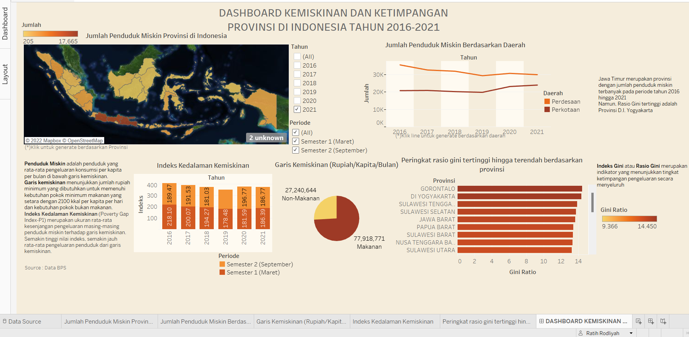
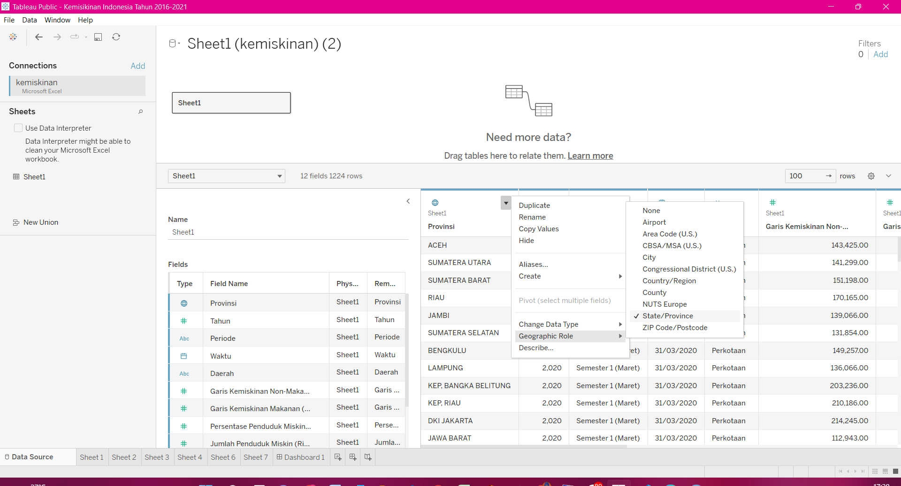
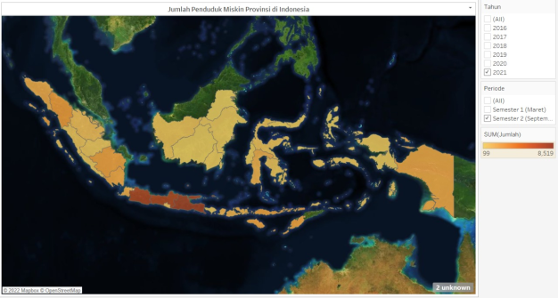
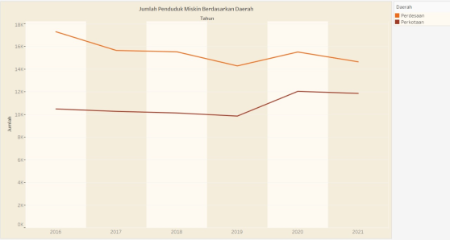
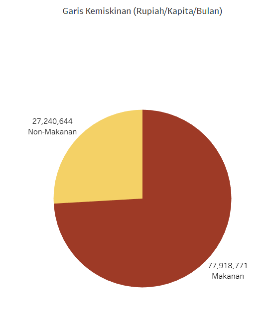
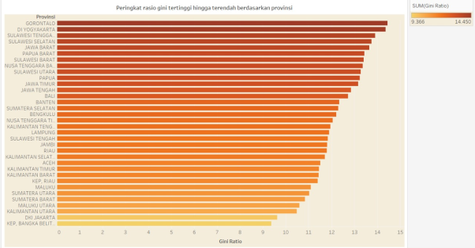
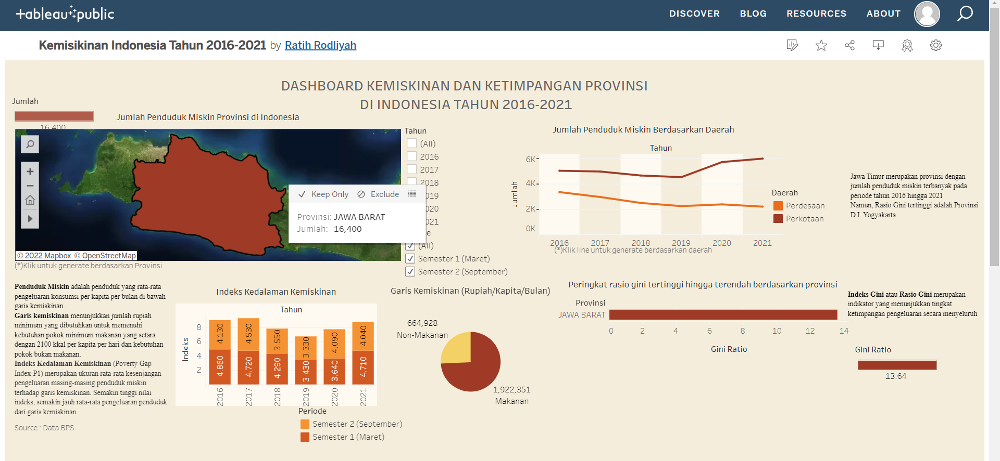

<!--
*** Thanks for checking out the Best-README-Template. If you have a suggestion
*** that would make this better, please fork the repo and create a pull request
*** or simply open an issue with the tag "enhancement".
*** Don't forget to give the project a star!
*** Thanks again! Now go create something AMAZING! :D
-->

<!-- PROJECT SHIELDS -->
<!--
*** I'm using markdown "reference style" links for readability.
*** Reference links are enclosed in brackets [ ] instead of parentheses ( ).
*** See the bottom of this document for the declaration of the reference variables
*** for contributors-url, forks-url, etc. This is an optional, concise syntax you may use.
*** https://www.markdownguide.org/basic-syntax/#reference-style-links
-->

<!-- PROJECT LOGO -->
 

  

  <h3 align="center">Dashboard Kemiskinan dan Ketimpangan Provinsi d Indonesia</h3>

  

    Ratih Rodliyah
     
    <a href="https://public.tableau.com/app/profile/ratih.rodliyah/viz/KemisikinanIndonesiaTahun2016-2021/Dashboard1?publish=yes"><strong>Explore Dashboard »</strong></a>
     
     
    <a href="https://public.tableau.com/app/profile/ratih.rodliyah/viz/KemisikinanIndonesiaTahun2016-2021/Dashboard1?publish=yes">View Dashboard</a>
    ·
    <a href="https://github.com/ratihrdlyh/dashboard-kemiskinan-dan-ketimpangan-Provinsi-Indonesia">Report Bug</a>
    ·
  

<!-- TABLE OF CONTENTS -->

  
Table of Contents

  <ol>
    <li>
      <a href="#abstrak">Abstrak</a>
      <ul>
        <li><a href="#built-with">Built With</a></li>
      </ul>
    </li>
    <li>
      <a href="#pengolahan-data">Pengolahan Data</a>
      <ul>
        <li><a href="#1-pengumpulan-data">Pengumpulan Data</a></li>
        <li><a href="#2-preprocessing-data">Preprocessing Data</a></li>
      </ul>
    </li>
    <li>
      <a href="#visualisasi-data">Visualisasi Data</a></li>
      <ul>
        <li><a href="#1-visualisasi-data-jumlah-penduduk-miskin-berdasarkan-provinsi-di-indonesia">Visualisasi data jumlah penduduk miskin berdasarkan provinsi di  Indonesia </a></li>
        <li><a href="#2-visualisasi-data-indeks-kedalaman-kemiskinan-berdasarkan-periode-di-indonesia">Visualisasi data Indeks Kedalaman Kemiskinan berdasarkan periode di Indonesia </a></li>
        <li><a href="#3-visualisasi-data-rasio-gini-berdasarkan-provinsi-di-indonesia">Visualisasi data Rasio Gini berdasarkan provinsi di Indonesia </a></li>
      </ul>
    <li><a href="#dashboard-visualisai-data-interaktif">Dashboard Visualisai Data Interaktif </a></li>
    <li><a href="#implementasi">Implementasi</a></li>
  </ol>

<!-- ABOUT THE PROJECT -->
## Abstrak

Kemiskinan dan ketimpangan adalah salah satu penghambat dalam pembangunan suatu negara. Sebagai negara yang besar, pemerataan ekonomi adalah hal yang harus dilakukan. Dalam menyelesaikan ini pemerintah membutuhkan sistem pengintegrasian untuk mengawasi kemiskinan dan ketimpangan pada 34 provinsi di Indonesia.

Data yang digunakan adalah hasil publikasi [BPS](https://www.bps.go.id/)

Dashboard interaktif dibuat megunakan `Tableau_Dekstop`, menggunakan visualisasi data kemiskinan dan ketimpangan provinsi di Indonesia yang diintegrasi menjadi dashboard dan diupload ke tableau public. Berikut link untuk mengakses :   [Dashboard-kemiskinan-ketimpangan](https://public.tableau.com/app/profile/ratih.rodliyah/viz/KemisikinanIndonesiaTahun2016-2021/Dashboard1?publish=yes).

(<a href="#top">back to top</a>)

### Built With

Tools yang digunakan dalam pembuatan Dashboard :

* [Tableau Dekstop](https://nextjs.org/)
* [Tableau Public](https://reactjs.org/)

(<a href="#top">back to top</a>)

<!-- GETTING STARTED -->
## Pengolahan Data
### 1 Pengumpulan Data

Data didapatkan dari website [BPS](https://www.bps.go.id/), diantaranya :
* Jumlah Penduduk Miskin (Ribu Jiwa) Menurut Provinsi dan Daerah, 2016-2021
* Indeks Kedalaman Kemiskinan (P1) Menurut Provinsi dan Daerah, 2016-2021
* Garis Kemiskinan Non-Makanan (Rupiah/Kapita/Bulan) Menurut Provinsi dan Daerah, 2016-2021
* Garis Kemiskinan Makanan (Rupiah/Kapita/Bulan) Menurut Provinsi dan Daerah, 2016-2021
* Gini Ratio Menurut Provinsi dan Daerah, 2016-2021
 
 

### 2 Preprocessing Data

Preprocessing data dilakukan  dengan 2 tahap, diantaranya :
* Data Cleaning, dengan mengatasi missing value menggunakan cara mengisi data yang hilang. Pengisian data yang hilang menggunakan pendekatan rata-rata di tiap variabelnya. 
* Data integration, dengan menyatukan data-data yang ada menjadi satu kesatuan yang utuh agar lebih mudah penggunaannya.
* Data transformasi, dengan mengubah tipe data kategorik provinsi menjadi data geographic agar dapat divisualisasikan menjadi map/peta. 

 
 

## Visualisasi Data

### 1)	Visualisasi data jumlah penduduk miskin berdasarkan provinsi di Indonesia
Visualisasi ini untuk menggambarkan jumlah penduduk miskin tiap provinsi di Indonesia menggunakan dua visualisasi, yaitu 

* Peta 
  Pada visualisasi peta, terdapat perbedaan warna tiap provinsinya. Warna pada visualisasi data pada peta menunjukkan banyaknya penduduk miskin, dengan jumlah paling sedikit sampai terbanyak digambarkan dengan perubahan warna dari kuning sampai coklat agak kemerahan. Visualisasi ini merupakan visualisasi utama dalam dashboard karena terdapat menu filter untuk tahun yaitu periode 2016 hingga 2021 dan periode semester 1 dan semester 2, sehingga dapat men-generate keseluruhan visualisasi pada dashboard.
  

  
  

   

* Line Chart 
  Terdapat dua garis pada Line chart dengan warna yang berbeda yaitu :
  - warna orange pada _daerah pedesaan_  
  - warna merah tua pada _daerah perkotaan_
  

  
  

 
 

### 2	Visualisasi data Indeks Kedalaman Kemiskinan berdasarkan periode di Indonesia
 
Pada tiap bar dalam chart, terdapat dua warna yaitu merah sebagai data Indeks Kedalaman Kemiskinan di semester 1 sedangkan  orange sebagai data jumlah penduduk miskin di semester 2

 
 

### 3	Visualisasi data Rasio Gini berdasarkan provinsi di Indonesia
 
Bar chart tersusun berdasarkan provinsi dengan Rasio Gini terbesar hingga terkecil. Rasio Gini dapat menggambarkan ketimpangan di Indonesia (Badan Pusat Statistik). Warna pada visualisasi data pada bar chart menunjukkan Rasio Gini dengan terbesar hingga terkecil digambarkan dengan perubahan warna dari coklat agak kemerahan sampai kuning. Pada bar chart dapat men-generate visualisasi data lain yaitu dengan meng-klik bar chart dengan provinsi tertentu sehingga dapat terlihat gambar provinsi pada peta secara lebih besar dan visualisasi data lainnya mengikuti.

 
 

## Dashboard Visualisai Data Interaktif
Visualisasi data yang sudah dibuat selanjutnya akan diintegrasikan menjadi satu kesatuan dalam suatu dashboard. Dashboard yang dibuat akan ditampilkan pada aplikasi web 

 
 

## Implementasi

Berikut contoh implementasi dashboard interaktif pada Tableau Public. 

Untuk menggunakan _Dashboard_ secara langsung, dapat mengakses link : [https://s.stis.ac.id/dashboard221910990](https://s.stis.ac.id/dashboard221910990)_

(<a href="#top">back to top</a>)

